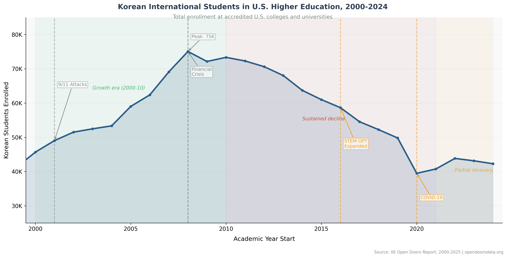
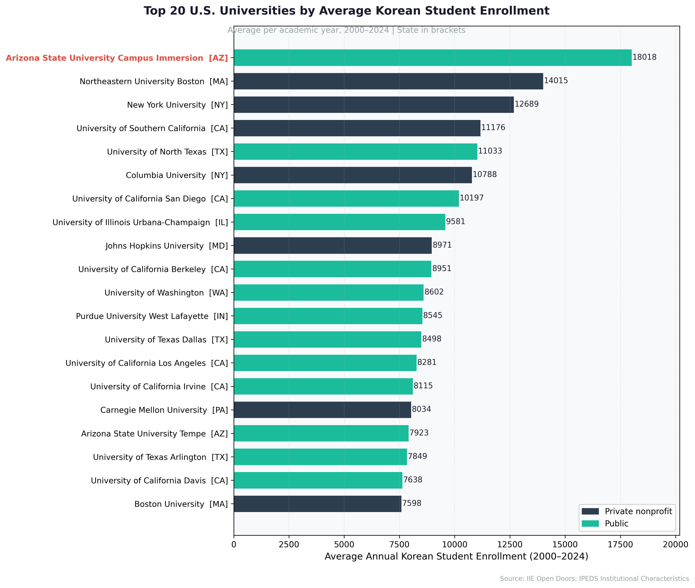
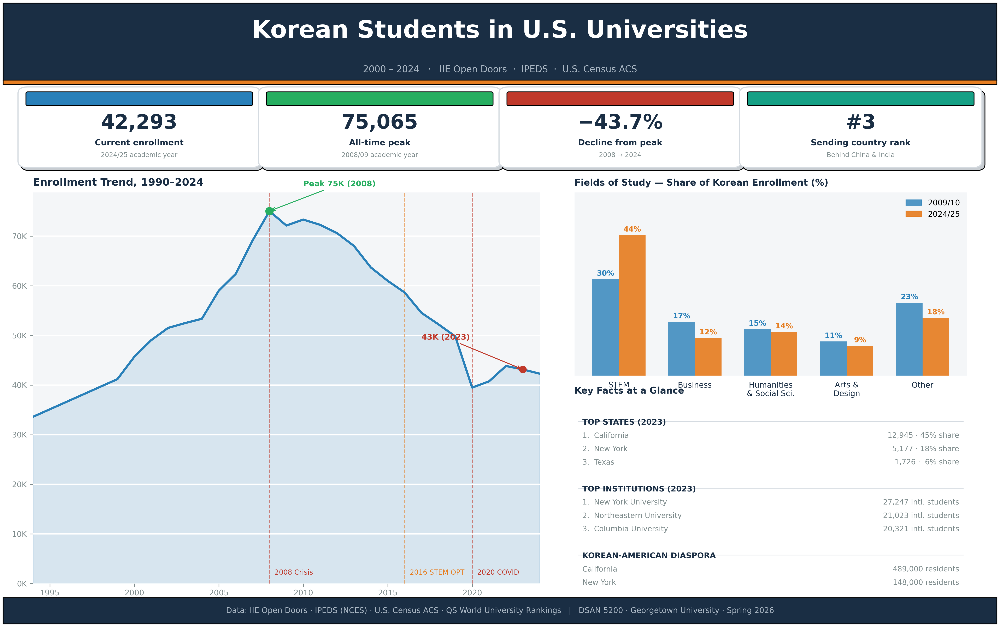

```{=html}
<!-- NAVIGATION -->
<nav>
  <ul>
    <li class="nav-logo"><a href="#">Korean Students in the U.S.</a></li>
    <li><a href="#where">Where?</a></li>
    <li><a href="#universities">Which Schools?</a></li>
    <li><a href="#why">Why?</a></li>
    <li><a href="#change">What Changed?</a></li>
    <li><a href="appendix.html">Appendix</a></li>
  </ul>
</nav>

<!-- HERO -->
<header class="hero">
  <div class="container">
    <p class="hero-kicker">A Data-Driven Narrative</p>
    <h1>Where Do Korean Students Go?</h1>
    <p class="subtitle">
      For two decades, South Korean students have been one of the largest groups of
      international students in the United States. But <em>where</em> they go —
      and why — has shifted in ways the headline numbers don't capture.
    </p>
    <p class="byline">By [Author Name] &nbsp;·&nbsp; April 2026 &nbsp;·&nbsp; Data: IIE Open Doors, IPEDS, DHS SEVIS</p>
  </div>
</header>
```

## Overview {#overview .section}

::: {.container--narrow}

In 2008, 75,065 South Korean students were enrolled at U.S. universities — the largest cohort
Korea had ever sent abroad and, at that moment, the single largest group of international
students from any country in America. Fifteen years later, that number had fallen to 43,149:
a decline of 42.5 percent, even as total international enrollment in the U.S. climbed to
record highs. China and India each now send more than six times as many students as Korea.

The headline decline is striking. But the distribution story is, in many ways, more interesting
than the totals. Despite the sharp drop in overall numbers, California and New York have held
onto the same share of Korean students they had two decades ago — roughly 45 percent and
18 percent respectively. What shifted was the institutional landscape within those states and
beyond: the rise of high-tuition private research universities, the surprising emergence of
STEM-intensive programs at schools that barely registered in 2000, and the unmistakable
fingerprint of a single policy change — the 2016 STEM OPT extension — on which programs
Korean students now choose.

This project traces that story through IIE Open Doors enrollment records, IPEDS institutional
data, QS rankings, and U.S. Census estimates of Korean-American population by state.
The patterns challenge several common assumptions: that prestige rankings drive student
concentration, that tuition is a deterrent, and that community proximity is a secondary factor.

```{=html}
<!-- STATIC FIGURE 1: Time series -->
<div class="chart-wrapper">
  <h3>Korean Students in U.S. Universities, 2000–2023</h3>
  
  <!-- Fallback: interactive Plotly version (uncomment when ready)
  <div id="chart-timeseries" style="height:450px;"></div>
  -->
  <p class="chart-caption">
    Source: IIE Open Doors, 2000–2023. Annotations mark IMF recovery period,
    post-9/11 dip, 2008 financial crisis, 2016 STEM OPT expansion, and COVID-19 onset.
  </p>
</div>

<!-- Key stats callout row -->
<div class="stat-grid">
  <div class="stat-card">
    <span class="number" id="stat-peak">—</span>
    <span class="label">Peak enrollment (year TBD)</span>
  </div>
  <div class="stat-card">
    <span class="number" id="stat-current">—</span>
    <span class="label">Most recent year count</span>
  </div>
  <div class="stat-card">
    <span class="number" id="stat-change">—</span>
    <span class="label">Change from peak</span>
  </div>
  <div class="stat-card">
    <span class="number" id="stat-rank">—</span>
    <span class="label">Rank among sending countries</span>
  </div>
</div>
```

:::

## Where Do They Go? {#where .section .section--alt}

::: {.container}
::: {.container--narrow style="padding:0;"}

For as long as reliable state-level data exists, California has been the overwhelming first
choice for Korean students in the United States. In 2000, the state hosted approximately
12,357 Korean students — about 45 percent of all Korean students enrolled in states with
tracked data. By 2023, the count had edged up to 12,945, and California's share remained
nearly unchanged. That stability is not inertia: it reflects a genuine gravitational pull.
California is home to more than 489,000 Korean-Americans — the largest Korean diaspora
community in the country — concentrated in Los Angeles County, Orange County, and the
Bay Area. For Korean students navigating an unfamiliar culture, proximity to established
communities offering familiar food, language, religious institutions, and social networks
is not a trivial factor. It is, the data suggests, a persistent one.

New York has consistently ranked second, hosting roughly 18 percent of Korean students
in states where data is available. Together, California and New York account for nearly
two-thirds of all tracked Korean student enrollment — a concentration that has not
meaningfully changed across two decades of policy shifts, economic cycles, and a global
pandemic. Texas, Illinois, and New Jersey round out the top five, each holding a
roughly 6 percent, 5.7 percent, and 3.6 percent share respectively.

What the state-level picture obscures is a meaningful shift in *which cities and
institutions* within those states are capturing Korean students. The state
distribution is stable; the institutional distribution is not. Within California, the
University of California system — Berkeley, Los Angeles, San Diego, and Irvine — now
collectively draws more international enrollment than it did twenty years ago, while
community college enrollment among Korean students has become a less common first step.
In New York, Columbia University and New York University have both grown their
international student bodies dramatically, but NYU's rise has been particularly steep,
growing from 5,399 total international students in 2000 to 27,247 by 2023.

The choropleth map below allows you to trace these patterns year by year. Use the
slider to watch how state totals rise through the mid-2000s, peak around 2008, contract
through the 2010s, and partially recover after 2021. The geographic footprint barely
changes; the intensity within it does.

:::

```{=html}
<!-- INTERACTIVE VIZ #1: Choropleth map with year slider -->
<div class="chart-wrapper">
  <h3>Korean Students by State, 2000–2023</h3>
  <iframe
    src="../figures/interactive/map_choropleth.html"
    height="520"
    title="Choropleth map of Korean student distribution by U.S. state with year slider"
    loading="lazy"
  ></iframe>
  <div id="map-placeholder" class="viz-placeholder">
    <p>📍 Interactive choropleth map — coming in Phase 4</p>
    <p style="font-size:0.85rem;">Will show: Korean students per state by year, with slider (2000–2023) and hover tooltips.</p>
  </div>
  <p class="chart-caption">
    Source: IIE Open Doors. Hover over a state to see student count and top 3 universities.
    Use the year slider to explore how distribution has shifted over time.
  </p>
</div>
```

:::

## The Universities They Choose {#universities .section}

::: {.container}
::: {.container--narrow style="padding:0;"}

Look across the top 20 U.S. universities by average international enrollment from 2000
to 2024 and a few patterns emerge quickly. Nearly all are private nonprofit or major
public research institutions. Most sit in large metropolitan areas — New York, Los Angeles,
Boston, Chicago, Seattle — with sizable Korean-American communities nearby. And virtually
all of them have expanded their international student bodies substantially over the past
two decades, meaning Korean students are competing for a slice of a growing pie rather
than a shrinking one.

New York University has led this list throughout the study period. Its total international
enrollment — 5,399 students in 2000 — grew to 27,247 by 2023, a five-fold increase that
reflects NYU's aggressive global recruitment strategy and its location in one of the
most Korean-populated cities in the country. The University of Southern California follows
closely, as does Columbia University, which benefits from both New York geography and
an elite research brand that consistently places in the top 15 of QS world rankings.

The most notable riser in the institutional leaderboard is Northeastern University in
Boston. Barely present in 2000, Northeastern reached 21,023 total international students
by 2023 — the second-highest total on the list. Northeastern's rise coincides precisely
with its strategic investment in cooperative education programs and STEM-track curricula,
making it highly attractive to students seeking not just a degree but a work authorization
pathway. Similarly, the University of Texas at Dallas and University of North Texas —
both regional schools that rarely appear in prestige rankings — have grown to become
significant destinations by offering affordable tuition, strong computing programs, and
proximity to the Dallas Korean-American corridor.

What the top 20 share most consistently is not prestige rank but rather a combination
of strong STEM offerings, an established international student services infrastructure,
and location within or near a Korean-American population center. Schools with QS ranks
between 50 and 150 are as well-represented in this cohort as those in the global top 20.
Rank alone does not explain where Korean students go.

:::

```{=html}
<!-- STATIC VIZ #2: Top 20 universities bar chart -->
<div class="chart-wrapper">
  <h3>Top 20 Universities by Average Korean Enrollment</h3>
  
  <p class="chart-caption">
    Source: IIE Open Doors, 2000–2023. Color indicates institution type:
    <span style="color:var(--color-data-1);">■ R1 Research</span>
    <span style="color:var(--color-data-2); margin-left:0.5rem;">■ Liberal Arts</span>
    <span style="color:var(--color-data-3); margin-left:0.5rem;">■ Other</span>
  </p>
</div>
```

:::

## Why Those Universities? {#why .section .section--alt}

::: {.container}
::: {.container--narrow style="padding:0;"}

If you assume that Korean families are optimizing for prestige — sending students to
the highest-ranked universities they can access — the data pushes back. The correlation
between a university's QS world ranking and its total international enrollment is −0.14:
essentially flat. Schools ranked in the 50–200 range enroll just as many international
students as those in the global top 10, and community colleges that carry no ranking
at all regularly appear in the top 25 institutions by Korean enrollment. Prestige, measured
this way, is a weak predictor.

Tuition tells a more counterintuitive story. Across institutions in the dataset, out-of-state
tuition correlates *positively* with international enrollment (r = 0.28). In plain
terms: higher-tuition schools attract more international students, not fewer. This is not
because Korean families are indifferent to cost. It is because high tuition, in the U.S.
higher education market, is bundled with institutional resources — research facilities,
career services, employer recruitment pipelines — that translate into post-graduation
outcomes. For a student who has crossed an ocean, the signaling value of a well-resourced
institution may outweigh a price difference that, at the margins of an already expensive
choice, seems secondary.

The most structurally important factor in the data, however, is STEM OPT eligibility.
Since 2016, graduates of designated STEM programs have been eligible for a 24-month
extension on their Optional Practical Training work authorization — bringing the total
from 12 to 36 months. The effect on Korean student behavior is visible in the field-of-study
data: STEM's share of Korean enrollment rose from 31 percent in 2016 to 44.5 percent
by 2024. Over the same period, business and management — once the dominant choice —
fell from 15 percent to 12 percent. The policy change effectively reorganized the
incentive structure for choosing a major.

Korean diaspora population compounds these effects. California's 489,000 Korean-Americans
help explain why the UC system, despite being a public university network with in-state
tuition incentives for California residents, draws so many out-of-state international
students. The social infrastructure of established communities — Korean churches, grocery
stores, language schools, professional networks — lowers the effective cost of living
and belonging in ways that never appear in tuition tables.

The scatter plot below lets you explore these relationships directly. Switch the X-axis
between QS rank, tuition, STEM OPT eligibility, and local Korean population to see which
factors align most tightly with enrollment concentration. No single factor dominates —
but the combination of STEM capacity, employer access, and community proximity draws a
clearer picture than ranking alone.

> Higher tuition schools, not lower-ranked ones, attract the most Korean students —
> suggesting that post-graduation employment access, not price, is the decisive variable.

:::

```{=html}
<!-- INTERACTIVE VIZ #2: Multi-variable scatter plot -->
<div class="chart-wrapper">
  <h3>What Predicts Korean Student Enrollment?</h3>
  <iframe
    src="../figures/interactive/scatter_explorer.html"
    height="580"
    title="Interactive scatter plot: university characteristics vs Korean student enrollment"
    loading="lazy"
  ></iframe>
  <div id="scatter-placeholder" class="viz-placeholder">
    <p>🔍 Interactive scatter plot — coming in Phase 4</p>
    <p style="font-size:0.85rem;">
      Will show: one dot per university. X-axis selectable (QS rank / tuition / STEM OPT /
      Korean population). Dot size = total international enrollment. Color = institution type.
    </p>
  </div>
  <p class="chart-caption">
    Source: IIE Open Doors, IPEDS, QS Rankings, U.S. Census ACS.
    Use the dropdown to change the X-axis variable. Hover over any university for details.
  </p>
</div>
```

:::

## What Changed — and Why? {#change .section}

::: {.container}
::: {.container--narrow style="padding:0;"}

Three macro events have left visible marks on Korean enrollment in U.S. universities,
each operating through a different mechanism.

The first was the 2008 global financial crisis. Korean enrollment peaked that year at
75,065 students and then began a decade-long contraction. The Korean won weakened sharply
against the dollar, making U.S. tuition more expensive in real terms for Korean families.
Meanwhile, Korean domestic universities improved in global rankings and graduate employment
outcomes, reducing the relative premium on a U.S. degree. By 2019, total Korean enrollment
had fallen to 49,809 — a 34 percent drop from peak — even as the overall international
student market in the U.S. grew.

The second inflection point came in 2016, when the Department of Homeland Security
extended the STEM OPT work authorization from 17 to 36 months. The policy change gave
STEM graduates three full years of post-graduation U.S. work eligibility, dramatically
improving the expected return on a STEM degree relative to a business or humanities
credential. The field-of-study data captures this shift cleanly: STEM's share of Korean
enrollment was 31.2 percent in 2015, climbed to 33.1 percent in 2016, and accelerated
steadily to 44.5 percent by 2024. Arts and Design, Humanities, and Business all gave up
ground. The linked view below shows how individual fields responded — click STEM and
Business to see the divergence clearly.

COVID-19 delivered the sharpest single-year shock in the dataset. From 49,809 students
in 2019, Korean enrollment fell to 39,491 in 2020 — a 20.7 percent drop in a single
academic year, as travel restrictions, campus closures, and visa processing delays
halted new enrollment. Recovery has been slow and incomplete. By 2023, total enrollment
had recovered to 43,149 — still 42 percent below the 2008 peak and 13 percent below
2019. The pandemic appears to have accelerated a structural trend already in progress:
Korean students choosing more selectively, favoring programs with clearer employment
pipelines over broad liberal arts offerings.

:::

```{=html}
<!-- LINKED VIEW: Field of study donut → enrollment trend -->
<div class="chart-wrapper">
  <h3>How Did Major Choice Shift Over Time?</h3>
  <p style="font-size:0.9rem; color:var(--color-neutral); margin-bottom:1rem;">
    Click a field of study in the left panel to update the trend line on the right.
  </p>
  <iframe
    src="../figures/interactive/linked_major_trend.html"
    height="500"
    title="Linked view: field of study donut chart linked to enrollment trend line"
    loading="lazy"
  ></iframe>
  <div id="linked-placeholder" class="viz-placeholder">
    <p>🔗 Linked view — coming in Phase 4</p>
    <p style="font-size:0.85rem;">
      Left: clickable donut chart of major categories.
      Right: enrollment trend for selected major, 2000–2023.
    </p>
  </div>
  <p class="chart-caption">
    Source: IIE Open Doors, Fields of Study by Place of Origin.
    The 2016 STEM OPT extension (from 17 to 36 months) is marked on the timeline.
  </p>
</div>
```

:::

## What the Data Tells Us {#conclusion .section .section--alt}

::: {.container--narrow}

Three findings stand out from this analysis. First, Korean student enrollment in the U.S.
has declined structurally — not cyclically — since 2008, driven by improving alternatives
at home and a strengthening Korean economy that makes the dollar cost of a U.S. degree
harder to justify. Second, geography has remained stubbornly concentrated: California and
New York hold the same share of Korean students today as they did twenty years ago,
anchored by Korean-American communities that provide social infrastructure no university
ranking can replicate. Third, policy shapes behavior faster than prestige does: the 2016
STEM OPT extension reorganized major choice within a single academic cycle, a shift that
has compounded every year since.

What the data cannot yet tell us is whether the post-COVID recovery will stabilize at
current levels or resume its pre-pandemic decline. Korean birth rates have fallen to
among the lowest recorded globally, which means the pool of prospective students is
already contracting at the source. The question worth sitting with is this: as the
Korean student pipeline shrinks, will U.S. universities compete harder for a smaller
cohort — or will Korean families increasingly turn to other destinations, and which ones?

```{=html}
<div class="chart-wrapper" style="text-align:center;">
  <h3>Korean Students in America — At a Glance</h3>
  
  <p class="chart-caption">
    All figures from IIE Open Doors 2023. See the
    <a href="appendix.html">technical appendix</a> for methodology.
  </p>
</div>
```

:::

```{=html}
<!-- FOOTER -->
<footer>
  <div class="container">
    <p>
      Data sources: IIE Open Doors · IPEDS (NCES) · DHS SEVIS · KEDI · QS World University Rankings · U.S. Census ACS
    </p>
    <p style="margin-top:0.5rem;">
      <a href="appendix.html">Technical Appendix</a> &nbsp;·&nbsp;
      <a href="#ai-usage">AI Usage Log</a> &nbsp;·&nbsp;
      <a href="https://github.com/YOUR_USERNAME/korean-students-us" target="_blank" rel="noopener">GitHub Repository</a>
    </p>
    <p style="margin-top:1rem; font-size:0.75rem; opacity:0.6;">
      Created for DSAN [Course Number] · Georgetown University · [Semester Year]
    </p>
  </div>
</footer>
```
